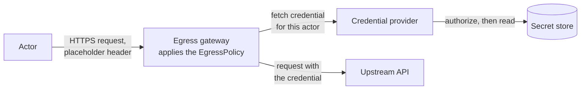

# Egress credential injection

Egress credential injection puts a secret into an actor's outbound HTTPS
requests without the actor ever holding it. It works on HTTPS the egress
gateway intercepts: an `https` rule in the actor's `EgressPolicy` has the
gateway terminate the actor's TLS for the names it lists and re-originate it
(see [egress-trust-bundle.md](egress-trust-bundle.md)). When that rule carries
a `replace_headers` effect and the actor's request includes a header it names,
the gateway resolves the referenced credential from a **credential provider**
and replaces the header's value with it (for example
`Authorization: Bearer <token>`) before the request leaves the cluster.

The actor never holds the secret. It sends the header with a placeholder
value, which the gateway discards, so it cannot read, snapshot, or exfiltrate
the secret, nor choose the value that leaves the cluster.


## When you need this

Actors call APIs that need bearer tokens or API keys, and those secrets must
stay out of the actor's filesystem, environment, and snapshots.

Injection happens only on HTTPS that an `https` rule allows, so the actor must
make the request over HTTPS and must trust the gateway CA — see
[egress-trust-bundle.md](egress-trust-bundle.md). Cleartext HTTP allowed by an
`http` rule is never injected into.

## How it works



1. The actor makes an HTTPS request, sending the header the policy names with
   a placeholder value. For a name an `https` rule lists, the gateway
   terminates the actor's TLS — the actor trusts the gateway CA through a
   projected trust bundle — and decides the decrypted request against the
   actor's `EgressPolicy`.
2. If the deciding rule has `replace_headers` and the request carries one of
   those headers, the gateway asks the credential provider for the credential
   that header names.
3. The provider decides whether that actor may have that credential, reads it
   from its secret store, and returns it. The provider is the **only**
   component in the path with access to secret storage — the gateway never
   reads secrets at rest.
4. The gateway replaces the placeholder with the credential and sends the
   request on to the origin over a new TLS connection.

The reference k8s secret provider, `cmd/credential-provider/kubernetes-secrets`, resolves
Kubernetes Secrets, and `internal/plugins/gcp-secret-manager` resolves Google
Cloud Secret Manager secrets. The installer deploys either one; see
[For cluster admins](#for-cluster-admins).

## The policy

Injection is declared in the `effects` of an `https` rule. This policy allows
HTTPS to `api.example.com` on port 443, the default, and replaces the actor's
`Authorization` header with a credential:

```bash
rules:
- https:
    hostnames: ["api.example.com"]
    effects:
      replaceHeaders:
      - header: Authorization
        prefix: "Bearer "
        credentialUri: ate-secret://k8s.io/default/ns1/example-api/token
```

The actor then sends the header with any placeholder value:

```bash
curl -H 'Authorization: placeholder' https://api.example.com/v1/items
```

This URI names the sample Secret deployed under [Enable it](#enable-it). The
sample namespace policy lets only actors in atespace `team-a` resolve it; an
actor in any other atespace gets a 403 until a cluster admin grants its
atespace access.

* `header` names the request header to replace.
* `prefix` is prepended verbatim to the credential — include the separator,
  e.g. `"Bearer "` with the trailing space.
* `credentialUri` names the credential; see [Credential URIs](#credential-uris).

### Credential URIs

A credential URI has the form `ate-secret://<provider-class>/<path>`: the host
names the provider that resolves it, and the path is that provider's to
interpret. A URI the provider refuses denies the request with 403.

* **Kubernetes Secrets** (provider class `k8s.io`) — see
  [The reference provider](#the-reference-provider).
* **Google Cloud Secret Manager** (provider class
  `secretmanager.googleapis.com`) — see its
  [README](../internal/plugins/gcp-secret-manager/README.md#credential-uris).

## What the gateway does

| Situation | Outcome |
|---|---|
| Request decided by an `https` rule, carries the header, provider configured, credential resolves | Header value replaced with the credential; request re-originated upstream |
| Request decided by an `https` rule, does not carry the header | Forwarded without the credential. |
| Cleartext request decided by an `http` rule with `replaceHeaders` | Injection **skipped**, request passes through without the credential — a secret is never put on a cleartext wire |
| No provider configured (injection not enabled at install) | **500**, fail closed, with the body `egress denied: the egress policy requires credential injection, but no credential provider is configured on this egress gateway` |
| URI names a provider class this gateway does not serve | **500**, fail closed, with the body `egress denied: credential provider "<class>" is not available on this egress gateway, which serves "<class>"` |
| Secret missing, or namespace not authorized for the atespace | **403**, fail closed |
| Provider unreachable or timed out | **503**, fail closed but retryable |
| Provider returns an empty credential, or one containing control characters | **503**, fail closed |
| Unusable header name; unparseable URI | **500**, fail closed |

The dividing line: skipping is only for cleartext, where the credential must
never be sent. On an intercepted HTTPS request any failure to produce the
credential the policy promised denies the request rather than letting it out
without it. A gateway with no provider for the policy's credential URI answers
500 with a body that names the problem, since only reinstalling the gateway
with that provider (see [Enable it](#enable-it)) can fix it; every other denial
body is a plain `egress denied`, and the reason is in the gateway's log.

## For cluster admins

### Enable it

**1. The gateway and its provider.** Injection is an install-time modifier on
the egress gateway and requires the Envoy dataplane (the default). Name the
provider to install with `--credential-provider`, and the installer deploys it
ahead of the gateway and points the gateway at it:

```bash
# Kubernetes Secrets:
hack/install-ate.sh --deploy-atenet --credential-provider k8s

# Google Cloud Secret Manager (see its README for the IAM grants it needs):
hack/install-ate.sh --deploy-atenet --credential-provider gsm
```

| `--credential-provider` | Provider class the gateway serves | Address the gateway dials | Authorization policy |
|---|---|---|---|
| `k8s` | `ate-secret://k8s.io` | `k8s-credential-provider.ate-system.svc:50051` | `k8s-credential-provider-namespace-policy` ConfigMap |
| `gsm` | `ate-secret://secretmanager.googleapis.com` | `gsm-credential-provider.ate-system.svc:50051` | `gsm-credential-provider-project-policy` ConfigMap ([README](../internal/plugins/gcp-secret-manager/README.md)) |

The flag implies `--experimental-egress-credential-injection` and
`--experimental-use-sdsmint`. A gateway serves one provider at a time: a policy
URI of any other class fails closed with 500. `--deploy-ate-system` honors the
flag too, and `--delete-atenet` and `--delete-ate-system` remove either
provider.

If the provider's authorization policy ConfigMap does not exist yet, the
installer creates it **default-deny**, so the provider starts but resolves
nothing until you grant atespaces access (step 2). An existing policy is never
overwritten.

To use a provider the installer does not deploy, pass
`--experimental-egress-credential-injection` with `--credential-provider-name`
(the class, as an `ate-secret://` prefix) and `--credential-provider-address`
instead, and deploy the provider yourself. Until something serves that
address, every matching injection rule fails closed with 503.

**2. Grant access.** For Secret Manager, follow steps 1 and 2 of the plugin
README's [Install](../internal/plugins/gcp-secret-manager/README.md#install):
grant the provider's Google identity access to your secrets, and list the
projects each atespace may read in its policy.

For the Kubernetes Secrets provider, edit the atespace→namespace policy and add
your secrets. The samples under `manifests/egress-credential-injection/` match
[the example policy](#the-policy):

```bash
# The atespace→namespace authorization policy (edit for your atespaces first;
# default-deny, so an atespace absent from it resolves nothing):
kubectl apply -f manifests/egress-credential-injection/namespace-policy.yaml

# A sample secret matching the sample policy:
kubectl apply -f manifests/egress-credential-injection/sample-secret.yaml
```

The provider loads the namespace policy **once at startup** and does not yet
reload it. After editing the ConfigMap, restart the provider:

```bash
kubectl -n ate-system rollout restart deployment/k8s-credential-provider
```

**3. The actors.** Actors can now add `replaceHeaders` effects to their
`https` rules, as described under [The policy](#the-policy). Each such actor
also needs the projected egress trust bundle to do TLS through the gateway at
all — see [egress-trust-bundle.md](egress-trust-bundle.md).

### Verify

Confirm the provider is ready (`gsm-credential-provider` for Secret Manager):

```bash
kubectl -n ate-system rollout status deployment/k8s-credential-provider
```

Then give an actor an `https` rule for `httpbin.org` that replaces a header,
have it request `https://httpbin.org/headers` with that header set to a
placeholder, and look for the credential in the echoed response.

If the request is denied instead, the gateway logs the reason:

```bash
kubectl -n ate-system logs deployment/atenet-egress -c ext-proc | grep 'egress denied'
```

### Operational notes

**Transient 503s right after (re)deploying the provider.** The gateway keeps a
long-lived gRPC channel to the provider. If the provider's Service was deleted
and recreated, the channel can sit in connect backoff for up to a couple of
minutes before re-resolving; injection fails closed with 503 (deliberately
retryable) until it reconnects.

**Scope of the reference provider's RBAC.** The sample deployment grants read
on Secrets cluster-wide so the policy may name any namespace; a production
deployment should scope this to the namespaces the provider is allowed to
serve (see the note in `k8s-credential-provider.yaml`).

## For credential provider developers

### The plugin API

The provider is a plugin: any gRPC service that implements
`CredentialProvider.FetchSecret` (`pkg/proto/credproviderpb/credprovider.proto`)
can back injection. To bring your own — reading HashiCorp Vault, Google Secret
Manager, or any other secret store — implement the API under your own provider
class (the URI host, e.g. `ate-secret://vault.example.com/...`), then have a
cluster admin point the gateway at it with `--credential-provider-name` and
`--credential-provider-address`. A gateway currently fronts **one** provider:
a policy URI naming any other class fails closed rather than being sent to the
wrong provider.

The gateway reads only the URI host, to confirm the URI targets the provider it
serves. Everything after the host is the provider's to interpret.

`internal/plugins/gcp-secret-manager` is such a provider for Google Cloud Secret Manager.

**Trust model.** The gateway dials the provider over mTLS with its own pod
identity, `spiffe://cluster.local/ns/ate-system/sa/atenet-egress`, and every
`FetchSecretRequest` carries the SPIFFE ID of the actor the gateway verified.
A provider should:

* accept only callers presenting the gateway's identity — the reference
  provider requires a client certificate chaining to the pod-identity trust
  bundle and pins that URI SAN on every connection; and
* enforce an actor-scoped authorization on the asserted actor SPIFFE ID — the
  gateway attests *which* actor is asking, but what that actor may resolve is
  the provider's decision.

**Status codes.** The gateway maps a `FetchSecret` failure onto the actor's
request: `NotFound` and `PermissionDenied` deny with 403 (retrying cannot
succeed); `Unavailable` and `DeadlineExceeded` fail closed with a retryable
503; any other code denies with 403.

### The reference provider

`cmd/credential-provider/kubernetes-secrets` is a working example to start
from. It resolves URIs of the `k8s.io` class,
`ate-secret://k8s.io/default/<namespace>/<secret>/<key>`, to Kubernetes Secret
values, and enforces a **default-deny atespace→namespace policy**, read from
the `k8s-credential-provider-namespace-policy` ConfigMap: an actor's atespace
may only resolve Secrets in namespaces explicitly granted to it.

## See also

* [egress-trust-bundle.md](egress-trust-bundle.md) — the TLS-terminated leg
  this feature runs on, and the actor-side trust projection it presupposes.
* `demos/egress/README.md` — how tunneled egress, actor identity, and policy
  authorization fit together.
* `pkg/proto/credproviderpb/credprovider.proto` — the provider plugin API and
  its trust model.
* `cmd/credential-provider/kubernetes-secrets` — the reference provider.
* `internal/e2e/suites/egresscredinject` — the e2e suite that proves the
  behavior table above. It runs only with `E2E_EGRESS_CREDINJECT=1`, against a
  cluster installed with `--experimental-egress-credential-injection`.
